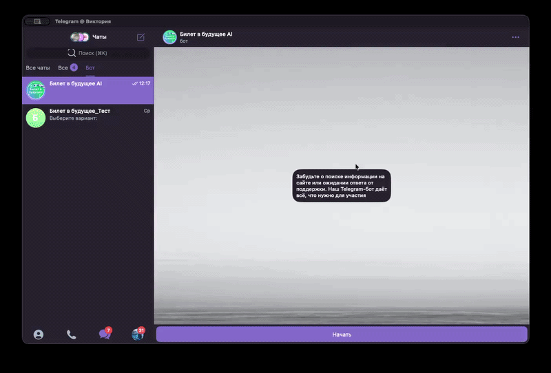

# 🤖 Bilet AI Bot


Интеллектуальный Telegram-бот для поддержки пользователей платформы «Билет в будущее».

Бот помогает быстро находить инструкции, отвечает на вопросы и снижает нагрузку на поддержку за счёт автоматизации.

---

## 🎬 Демо



---

## 🚀 Возможности

- 🔍 Интеллектуальный поиск по базе знаний (RAG)
- 🧠 Понимание естественного языка
- ❓ Уточнение запросов через кнопки
- 📚 Подробные ответы с пошаговыми инструкциями и медиа
- 🛡 Система фильтрации (Guard)
- 📊 Аналитика качества ответов
- 👨‍💼 Админ-панель в Telegram

---

## 👥 Роли пользователей

- Региональный оператор (CRM «Билет в будущее: Управление»)
- Педагог (ЛК «Единая модель профориентации»)

---

## 🏗 Архитектура проекта
bilet_ai/
├── bot/ # Telegram интерфейс
├── services/ # AI + бизнес-логика (RAG, guard, embeddings)
├── db/ # База данных
├── data/ # Инструкции и материалы
├── core/ # Логирование и утилиты
├── logs/ # Логи системы
├── main.py # Точка входа
├── config.py # Конфигурация


---

## 🧠 AI и логика

- RAG (Retrieval-Augmented Generation)
- Embeddings + векторный поиск
- Лексический скоринг
- Кэширование знаний
- Нормализация запросов
- Детектор уточняющих вопросов

---

## 🛡 Безопасность (Guard)

- Фильтрация запрещённых тем
- Модерация запросов
- Логирование срабатываний
- Контроль качества ответов

---

## 📊 Аналитика и мониторинг

- Качество ответов (accuracy tracking)
- Проблемные вопросы пользователей
- Статистика Guard-срабатываний
- Логи запросов и ответов
- Скорость обработки запросов

---

## 🎯 Назначение проекта
- автоматизация поддержки пользователей
- снижение нагрузки на операторов
- ускорение получения информации
- повышение качества ответов

---

## 🔐 Безопасность
- .env файлы не хранятся в репозитории
- все ключи только на сервере
- доступ к админке ограничен ролями

---

## 🐳 Быстрый старт

```bash
docker compose up -d --build
```
---

## 👨‍💻 Автор

Виктория (VikiZV)  
Python Developer / QA Engineer  

GitHub: https://github.com/VikiZV 
